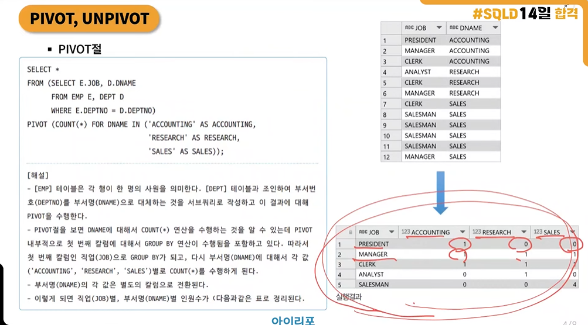

영상 요약  
pivot과 unpivot
pivot은 모니터로 치면 세로로 돌리는 것과 같다.  

피벗은 왜 필요한가?  
데이터의 형태를 생각해보아야 한다.  
보기 편한 데이터 / 집계함수를 쓸 수 있는 데이터 형태가 다르다!  

pivot > 행을 열로 바꾼다.  


전치행렬과는 다른 개념이다.  


1번
```
-- 각 직업별 Index를 세기 위한 변수 설정
SET @D=0, @P=0, @S=0, @A=0;

-- 문자의 알파벳순서에서 최소값(예: A)로 시작하는 것을 추출하자!
SELECT MIN(Doctor), MIN(Professor), MIN(Singer), MIN(Actor)
FROM (SELECT CASE WHEN Occupation = 'Doctor' THEN Name END AS Doctor,
             CASE WHEN Occupation = 'Professor' THEN Name END AS Professor,
             CASE WHEN Occupation = 'Singer' THEN Name END AS Singer,
             CASE WHEN Occupation = 'Actor' THEN Name END AS Actor,
             CASE
                 WHEN Occupation = 'Doctor' THEN (@D:=@D+1)
                 WHEN Occupation = 'Professor' THEN (@P:=@P+1)
                 WHEN Occupation = 'Singer' THEN (@S:=@S+1)
                 WHEN Occupation = 'Actor' THEN (@A:=@A+1)
             END AS RowNumber
      FROM Occupations
      ORDER BY Name) sub
GROUP BY RowNumber;

```
아직 정확히 모르겠지만...  
피벗으로 하는 것보다 case when으로 보니까 좀 더 직관적이었다.
(@A:=@A+1) 이런 식으로 row index를 매겨서 합쳐주는 방식을 알게 된 것 같다.
구현해내는 데에는 실패했다...


2번
칼럼 요약
```
1.좌변을 연산하지 마라.
2. OR 대신 Union을 사용하라
3. 필요한 Row, Column만 가져와라.
4. 분석 함수를 최대한 활용하라
5. 와일드카드(%) 는 끝에 작성하는것이 더 좋다
6. 계산값을 미리 저장해두고, 나중에 사용하라.

1. 데이터의 원본을 유지하면서 활용하는 게 좋다. year(date)보다는 WHERE date >= '2021-01-01' AND date <= '2021-12-31' !

2. or로 조건 두개 걸기보다는 각각 셀렉트해서 유니온
SELECT * FROM employees WHERE department = 'Marketing'
UNION
SELECT * FROM employees WHERE department = 'IT';

4.row_number(), rank() dense_rank() lead() leg() 등
5. like와 함께 쓸 때 john%처럼 써야 한다
```

```
UPDATE customers c
SET
    avg_order_value = (
        SELECT AVG(od.quantity * od.unit_price)
        FROM order_details od
        JOIN orders o ON od.order_id = o.order_id
        WHERE o.customer_id = c.customer_id
    ),
    total_spent = (
        SELECT SUM(od.quantity * od.unit_price)
        FROM order_details od
        JOIN orders o ON od.order_id = o.order_id
        WHERE o.customer_id = c.customer_id
    ),
    num_orders = (
        SELECT COUNT(DISTINCT o.order_id)
        FROM orders o
        WHERE o.customer_id = c.customer_id
    ),
    repurchase_rate = (
        SELECT
            COUNT(DISTINCT CASE WHEN od.product_id IN (
                SELECT product_id
                FROM order_details
                JOIN orders o ON order_details.order_id = o.order_id
                WHERE o.customer_id = c.customer_id
                GROUP BY order_details.product_id
                HAVING COUNT(order_details.product_id) > 1
            ) THEN od.product_id END) * 1.0 / COUNT(DISTINCT od.product_id)
        FROM order_details od
        JOIN orders o ON od.order_id = o.order_id
        WHERE o.customer_id = c.customer_id
    );
```

1. 정답 쿼리에서 `repurchase_rate`를 구할 때 사용한 `HAVING COUNT(order_details.product_id) > 1`의 의미는 무엇인가요?
   특정 재품을 재구매 (카운트 2 이상)을 의미한다.
   
2. 이 문제에서 사용될 수 있는 성능을 최적화하기 위한 방법은 무엇일까요?

계산값을 미리 저장해두고 나중에 사용하는 방법을 활용할 수 있을 것 같다.

```
WITH customer_orders AS (
    SELECT 
        o.customer_id,
        od.product_id,
        SUM(od.quantity * od.unit_price) AS total_spent,
        AVG(od.quantity * od.unit_price) AS avg_order_value,
        COUNT(DISTINCT o.order_id) AS num_orders
    FROM order_details od
    JOIN orders o ON od.order_id = o.order_id
    GROUP BY o.customer_id, od.product_id
),
repurchase_info AS (
    SELECT
        customer_id,
        COUNT(DISTINCT CASE WHEN COUNT(product_id) > 1 THEN product_id END) OVER (PARTITION BY customer_id) AS repurchase_count,
        COUNT(DISTINCT product_id) OVER (PARTITION BY customer_id) AS unique_products
    FROM order_details od
    JOIN orders o ON od.order_id = o.order_id
    GROUP BY customer_id, product_id
)
UPDATE customers c
SET
    avg_order_value = (SELECT avg_order_value FROM customer_orders co WHERE co.customer_id = c.customer_id),
    total_spent = (SELECT total_spent FROM customer_orders co WHERE co.customer_id = c.customer_id),
    num_orders = (SELECT num_orders FROM customer_orders co WHERE co.customer_id = c.customer_id),
    repurchase_rate = (
        SELECT 
            COALESCE(repurchase_count * 1.0 / unique_products, 0)
        FROM repurchase_info ri
        WHERE ri.customer_id = c.customer_id
    );
```
   
