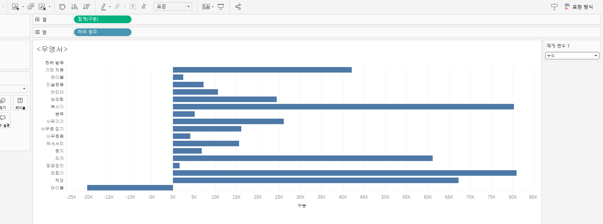

# Fifth Study Week

- 39강: [LOD](#39강-lod)

- 40강: [EXCLUDE](#40-lod-exclude)

- 41강: [INCLUDE](#41-lod-include)

- 42강 : [매개변수](#42-매개변수)

- 43강 : [매개변수 실습](#43-매개변수-실습) 


- 44강: [매개변수 실습](#44-매개변수-실습)

- 45강: [마크카드](#45-워크시트-마크카드)

- 46강: [서식계층](#46-서식-계층)

- 47강: [워크시트](#47-워크시트-서식)

- [문제1](#문제-1)

- [문제2](#문제-2)

## Study Schedule

| 강의 범위     | 강의 이수 여부 | 링크                                                                                                        |
|--------------|---------|-----------------------------------------------------------------------------------------------------------|
| 1~9강        |  ✅      | [링크](https://www.youtube.com/watch?v=AXkaUrJs-Ko&list=PL87tgIIryGsa5vdz6MsaOEF8PK-YqK3fz&index=84)       |
| 10~19강      | ✅      | [링크](https://www.youtube.com/watch?v=AXkaUrJs-Ko&list=PL87tgIIryGsa5vdz6MsaOEF8PK-YqK3fz&index=75)       |
| 20~29강      | ✅      | [링크](https://www.youtube.com/watch?v=AXkaUrJs-Ko&list=PL87tgIIryGsa5vdz6MsaOEF8PK-YqK3fz&index=65)       |
| 30~38강      | ✅      | [링크](https://www.youtube.com/watch?v=e6J0Ljd6h44&list=PL87tgIIryGsa5vdz6MsaOEF8PK-YqK3fz&index=55)       |
| 39~47강      | ✅      | [링크](https://www.youtube.com/watch?v=AXkaUrJs-Ko&list=PL87tgIIryGsa5vdz6MsaOEF8PK-YqK3fz&index=45)       |
| 48~59강      | 🍽️      | [링크](https://www.youtube.com/watch?v=AXkaUrJs-Ko&list=PL87tgIIryGsa5vdz6MsaOEF8PK-YqK3fz&index=35)       |
| 60~69강      | 🍽️      | [링크](https://www.youtube.com/watch?v=AXkaUrJs-Ko&list=PL87tgIIryGsa5vdz6MsaOEF8PK-YqK3fz&index=25)       |
| 70~79강      | 🍽️      | [링크](https://www.youtube.com/watch?v=AXkaUrJs-Ko&list=PL87tgIIryGsa5vdz6MsaOEF8PK-YqK3fz&index=15)       |
| 80~89강      | 🍽️      | [링크](https://www.youtube.com/watch?v=AXkaUrJs-Ko&list=PL87tgIIryGsa5vdz6MsaOEF8PK-YqK3fz&index=5)        |


<!-- 여기까진 그대로 둬 주세요-->

> **🧞‍♀️ 오늘의 스터디는 지니와 함께합니다.**


## 39강. LOD

<!-- INCLUDE, EXCLUDE, FIXED 등 본 강의에서 알게 된 LOD 표현식에 대해 알게 된 점을 적어주세요. -->

LOD > level of detail
현재 뷰와 관계없이 원하는 세부수준에서 계산하는 것을 말한다.

```
1. fixed에서 설정한 차원이 뷰에 포함
{FIXED [지역]: SUM([매출])} -> 지역 수준별 매출이 계산되어 나타남
2. fixed에서 설정한 차원이 뷰에 포함되어있지 않음
> 뷰 설정이 아닌 FIXED에서 설정한 차원을 기준으로 계산되어 나타남
```
>즉, 뷰에서 제외해도 원하는 기준으로 계산된 값을 보고 싶을 때 FIXED가 적합함을 알 수 있다.

## 40. LOD EXCLUDE

<!-- INCLUDE, EXCLUDE, FIXED 등 본 강의에서 알게 된 LOD 표현식에 대해 알게 된 점을 적고, 아래 두 질문에 답해보세요 :) -->

EXCLUDE는 특정 필드 제외한 기준을 설정할 때 사용한다.
{FIXED [범주]: SUM([매출])}
{EXCLUDE [하위 범주]: SUM([매출])} 
동일한 결과를 출력한다.
> **🧞‍♀️ FIXED와 EXCLUDE을 사용하는 경우의 차이가 무엇인가요?**

```
하위 범주 수준을 변경하면 FIXED는 값이 변경되지 않지만 EXCLUDE는 값이 변경된 범주 기준으로 바뀐다.
> EXCLUDE는 필터의 영향을 받는다!
```

> **🧞‍♀️ 왜 ATTR 함수를 사용하나요?**

```
SUM([매출]) - ATTR([EXCLUDE 하위 범주 매출])에서 ATTR 함수는 집계하는 필드의 값을 ATTRIBUTE(속성)으로 받아서 단일 값으로 처리, 계산의 정확성을 높인다.
```


## 41. LOD INCLUDE

<!-- INCLUDE, EXCLUDE, FIXED 등 본 강의에서 알게 된 LOD 표현식에 대해 알게 된 점을 적고, 아래 두 질문에 답해보세요 :) -->
include - > 뷰에서 특정 차원 포함, 차원 필터로 값 변경 가능

> **🧞‍♀️ 그렇다면 어떤 경우에 각 표현식을 사용하나요? 예시와 함께 적어보아요**

```
fixed
주문 아이디에 따른 평균 매출
AVG({INCLUDE[주문 ID]: SUM([매출])
AVG({FIXED[주문 ID]: SUM([매출])
등등 같은 값을 다른 함수로 표현할 수 있다. 하지만
FIXED는 차원과 측정값을 모두 반환할 수 있고
나머지 두개는 측정값만을 반환할 수 있다.

```

## 42. 매개변수

<!-- 매개변수에 대해 알게 된 점을 적어주세요 -->
1. 매개변수는 계산식 필터 참조선과 함께 사용된다.
매개변수를 바꿈으로써 간단하게 값을 변경할 수 있다.
방법 1. 값 > 드롭다운 > 매개변수 만들기
2. 원하는 필드 위 우클릭 > 매개변수
3. 데이터 패널에서 만들기

> **🧞‍♀️ 집합에도 매개변수를 적용할 수 있나요? 시도해봅시다**

적용할 수 있다!
> 집합을 색상으로 드래그 > 매개변수 값에 따라 색상으로 구분된다

## 43. 매개변수 실습
```
계산식을 활용한 매개변수를 통해 차원을 변경할 수 있다 (행에 드래그 안해도됨)
매개변수 > 문자열 > 목록 > 원하는 차원 입력
매개변수는 단독으로 사용하지 못하기 때문에 작동시킬 계산된 필드가 있어야 한다.
CASE[매개변수] WHEN 국가 THEN [국가/지역] .... END  > 행으로 드래그

매개변수에 따른 제목 > 시트 상단 제목 삽입 > 매개변수 > <차원선택하기>에 따른 매출
```

## 44. 매개변수 실습

```
매개변수 참조선
분석패널 > 참조선 > 라인 값을 매개변수로 설정
이걸 더 효과적으로 보여주려면 계산된필드를 만들어서 색상에 넣어주는 것도 좋다

시계열데이터에 날짜로 적용해서 특정 구간의 데이터 하이라이트 가능
```

## 45. 워크시트 마크카드

```
마크유형에 맵을 선택
여러 마크를 선택할 수 있다. 
```


## 46. 서식 계층

```
서식 > 통합문서에서 일괄적 서식 적용 가능
위 계층 서식을 변경해도 더 아래 계층에 설정된 서식은 변경되지 않음

```

> **🧞‍♀️ 서식계층을 일반적인 것에서 구체적인 것 순서로 기입해보세요**


```
워크 시트 서식
행/열 서식
특정 필드
필드 레이블
도구설명/제목/마크
```


## 47. 워크시트 서식

```
상단 서식 탭 확인
1. 글꼴
-> 머리글별로 색상 선택 가능 
2. 맞춤
-> 텍스트 정렬과 방향 설정 가능
3. 음영
-> 데이터 셀에 음영 적용
-> 행/열 색상 교차로 구간 설정 가능
```


## 문제 리스트


## 문제 1.

```
가장 많이 주문한 사람들은 물건 배송을 빨리 받았을까요?
조건을 준수하여 아래 이미지를 만들어봆시다.
1) 국가/지역별(이하 '나라'로 통칭), 범주별로 배송일자가 다를 수 있으니 먼저, 나라별/범주별로 평균 배송일자를 설정한 뒤,
2) 각 나라에서 가장 많이 주문한 사람의 이름을 첫 번째 열,
3) 그 사람이 주문한 제품 이름을 2번째 열,
4) 각 상품이 배송까지 걸린 날 수를 표현하고
5) 그리고 만약 배송이 각 나라/범주별 평균보다 빨랐다면 '빠름', 같다면 '평균', 느리다면 '느림' 으로 print 해주세요. 
```


<!-- 여기까지 오는 과정 중 알게 된 점을 기입하고, 결과는 시트 명을 본인 이름으로 바꾸어 표시해주세요.-->
생각보다 함수 짜는 게 코딩하는 거랑 비슷하다...


## 문제 2.

```
채원이는 태블로를 쓰실 수 없는 상사분께 보고하기 위한 대시보드를 만들고 싶어요. 

제품 중분류별로 구분하되 매개변수로써 수익, 매출, 수량을 입력하면 저절로 각각 지표에 해당하는 그래프로 바뀌도록 설계하고자 해요.

 어떤 값이 각 지표의 평균보다 낮은 값을 갖고 있다면 색깔을 주황색으로, 그것보다 높다면 파란색으로 표시하고 싶어요. 그 평균값은 각 지표별로 달라야 해요.
```



강의 예제에 추세선을 넘느냐 안넘느냐처럼 해서 색상에 넣어서 하는 것 같은데 각각 지표에 해당하는 평균을 적용하는 법을 모르겠음..
제출 이후에 다시 해보겠습니다.
