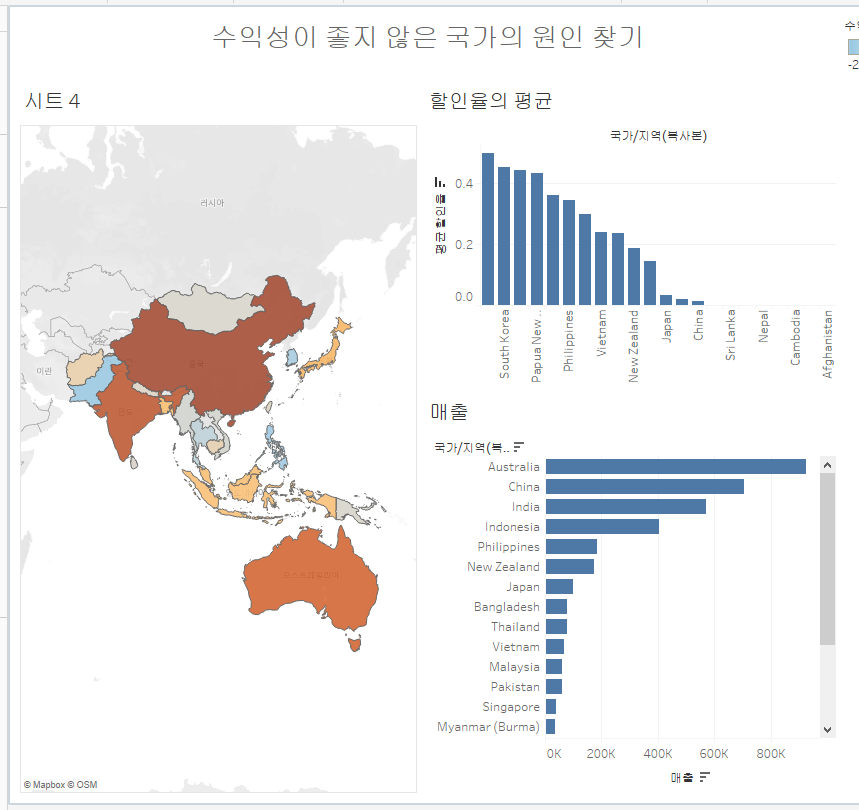
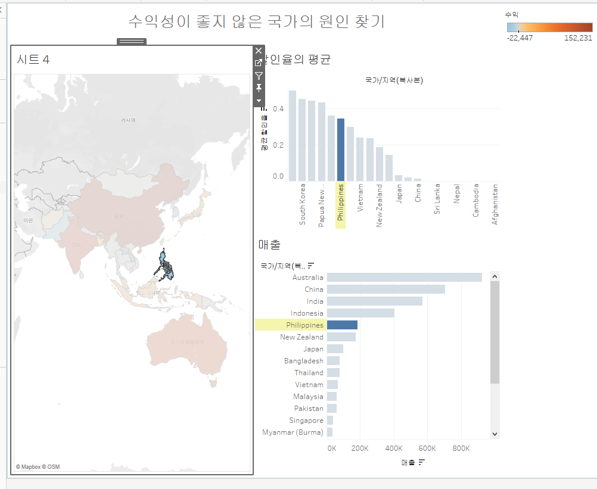

# Sixth Study Week


## Study Schedule
<br>

| 회차 | 강의 범위   | 강의 이수 여부 | 링크                                                                                                     |
|------|-------------|----------------|--------------------------------------------------------------------------------------------------------|
| 1    | 1~7강       | ✅              | [링크](https://www.youtube.com/watch?v=AXkaUrJs-Ko&list=PL87tgIIryGsa5vdz6MsaOEF8PK-YqK3fz&index=84)    |
| 2    | 8~17강      | ✅              | [링크](https://www.youtube.com/watch?v=AXkaUrJs-Ko&list=PL87tgIIryGsa5vdz6MsaOEF8PK-YqK3fz&index=75)    |
| 3    | 18~27강     | ✅              | [링크](https://www.youtube.com/watch?v=AXkaUrJs-Ko&list=PL87tgIIryGsa5vdz6MsaOEF8PK-YqK3fz&index=65)    |
| 4    | 28~37강     | ✅              | [링크](https://www.youtube.com/watch?v=e6J0Ljd6h44&list=PL87tgIIryGsa5vdz6MsaOEF8PK-YqK3fz&index=55)    |
| 5    | 38~47강     | ✅              | [링크](https://www.youtube.com/watch?v=AXkaUrJs-Ko&list=PL87tgIIryGsa5vdz6MsaOEF8PK-YqK3fz&index=45)    |
| 6    | 48~57강     | ✅              | [링크](https://www.youtube.com/watch?v=AXkaUrJs-Ko&list=PL87tgIIryGsa5vdz6MsaOEF8PK-YqK3fz&index=35)    |
| 7    | 58~67강     | 🍽️             | [링크](https://www.youtube.com/watch?v=AXkaUrJs-Ko&list=PL87tgIIryGsa5vdz6MsaOEF8PK-YqK3fz&index=25)    |
| 8    | 68~77강     | 🍽️             | [링크](https://www.youtube.com/watch?v=AXkaUrJs-Ko&list=PL87tgIIryGsa5vdz6MsaOEF8PK-YqK3fz&index=15)    |
| 9    | 78~85강     | 🍽️             | [링크](https://www.youtube.com/watch?v=AXkaUrJs-Ko&list=PL87tgIIryGsa5vdz6MsaOEF8PK-YqK3fz&index=5)     |
---

<br/>
<!-- 여기까진 그대로 둬 주세요-->

> **🧞‍♀️ 오늘은 강의보다 실습과 대시보드 직접 만들기가 더 중요하니, 기록보다는 사고하며 강의를 들어주세요.**

## 48. 워크시트 서식(2)

<!-- 워크시트에 관해 본 강의에서 알게 된 점을 적어주세요 -->
테두리 서식으로 수준에 따라서 눈금을 추가할 수 있다 (값이 포함된 거에서 구분하기 좋을 듯 하다)  
라인 서식도 가능하다 (추세선에서 전체 선을 긋는 느낌)


## 49강. 대시보드패널

<!-- 대시보드패널 강의에서 알게 된 점을 적어주세요. -->
```
여러 개의 차트를 한번에 표시할 수 있다.  
새 대시보드를 클릭 > 시트와 개체를 배치하는 방식으로 만들어진다.  
크기 > 대시보드 크기  
만들었던 시트들 외에도 개체에서 다른 항목을 추가할 수 있다.
```


## 50. 대시보드 구성방식

<!-- 알게 된 점을 적고, 아래 질문에 답해보세요 :) -->
> **🧞‍♀️ 부동과 바둑판식 방식을 차이를 중점으로 기술해보세요**
```
개체 추가하는 방식은 2가지가 있다

바둑판식 > 격자무늬의 특정 위치 에 맞추어 배치
개체 배치 후 다른 개체들의 위치가 맞추어 자동 변경
부동 > 개체 자유롭게 배치
개체 위치 변경해도 다른 개체들의 크기가 변하지 않음

```

## 51. 대시보드 컨테이너
```
개체를 대시보드에 배치하기 전에 컨테이너를 먼저 배치할 수 있다.
컨테이너는 대시보드 개체와 워크시트를 그룹화하고 구성할 수 있는 공간이다.
컨테이너 > 가로 / 세로 컨테이너
```

## 52. 레이아웃 패널
```
그래프 > 레이아웃에서 옵션 선택 가능
부동개체로 변환 가능
개체 테두리 선 설정 가능
백그라운드 > 배경 색 설정
여백 > 여백 양식 통일 가능
항목 계층
```

## 53. 필터 동작

<!-- 필터 동작에 대해 알게 된 점을 적어주세요 -->
```
1. 차트 클릭 > 드랍다운 > 필터
2. 대시보드 동작 > 대시보드 차트와 직접 사용 가능 (국가 클릭시 다른 워크시트도 국가 데이터로 변경
  워크시트 연계하는 법
  1. 대시보드 > 동작 > 동작추가 > 필터
  2. 원본시트에 바꿀 시트
  3. 대상 시트에 변경될 워크시트
3. 대시보드 필터 만드는 다른 방법 (차트 선택 > 필터로 사용 클릭시 자동으로 추가)
```

## 54. 대시보드 하이라이터 동작

<!-- 하이라이터에 대해 알게 된 점을 적어주세요 -->
```
전체 데이터 중에서 조건에 따라 데이터가 하이라이트됨
(분상형 차트)
원하는 데이터와 남은 데이터를 비교하고 싶을 때 유용하다.
```


## 55. 대시보드 URL

<!-- URL에 대해 알게 된 점을 적어주세요 -->
```
동작 > url로 이동 > 동작 실행 조건 > 메뉴
웹페이지 개체를 대시보드에 넣으면 웹사이트가 표시됨
```


## 56. 대시보드 시트에 이동 동작

<!-- 대시보드 시트에 이동에 대해 알게 된 점을 적어주세요!-->
```
눌렀을 때 다른 대시보드로 이동하는 동작
한 대시보드에서 요소가 너무 많아 가독성이 떨어질 때 활용하면 좋다
두번째 대시보드에 대한 필터도 잊지 말고 걸어주자 (필터 동작으로)
돌아가기 버튼 (단추)도 만들어주면 좋다
```

## 57. 매개변수 변경 동작

<!-- 매개변수 변경 동작에 대해 알게 된 점을 적어주세요!-->
```
매개변수 변경 동작
동작 추가 > 매개변수 > 대상매개변수와 원본 선택

```

## 문제

오늘은 별도의 문제가 없습니다. 





실력 + 가독성의 문제로... 생각보다 많은 요소를 집어넣지는 못하였다
지도에서 색상으로 수익이 +인 국가와 -인 국가를 한눈에 볼 수 있게 하고
파란색 국가들을 클릭했을 때 매출 규모를 확인할 수 있게 했으며, 할인율이 높은 수준임을 확인할 수 있게 하였다

실제 사용 사례를 생각해보면
파란색 국가들을 하나씩 눌러보며 
매출 수준도 너무 작고 할인율도 높아 수익도 마이너스 -> 사업 철수
매출 수준은 유의미하나 할인율이 높아 수익 마이너스 -> 사업 개선
쪽으로 제안할 때 유용할 것 같다.
(실제로 수익이 마이너스인 대부분의 국가에서 할인율이 높은 수준이었다.)

